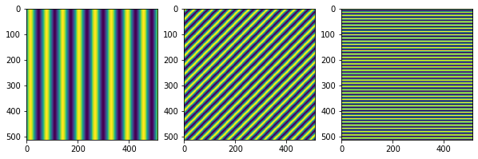
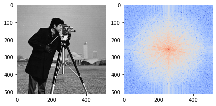
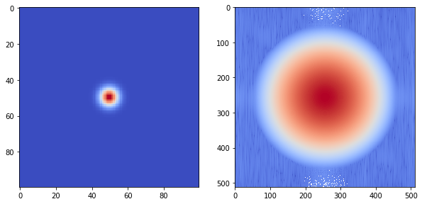
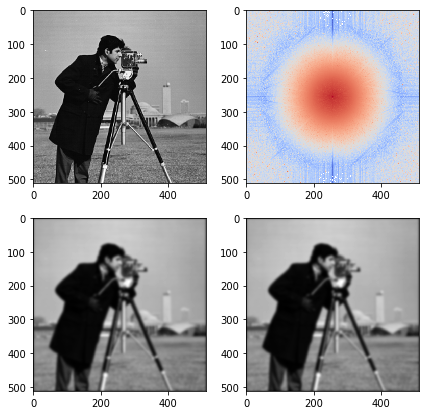

```python
import matplotlib.pyplot as plt
import numpy as np
from skimage.data import camera
from skimage.draw import circle
from skimage.filters import gaussian
from dig.fft import * 
raw = camera()
```

# Introduction

In this post, we will show how you can analyze digital images using Fourier analysis. I've previously covered how to use fourier analysis with functions of time so we will be extending those ideas to higher dimensions. Anyway, the central idea of fourier analysis is that you can expression any function as a sum of infinitely many sinusoidal basis functions. The main difference between 1D and 2D is not only that the basis functions are two-dimensional but that those functions can have an arbitrary orientation. 


# 2D Fourier Basis Functions

Each basis function in 2D has a magnitude and phase. The magnitude represents the spatial frequency of the sinusoid and the phase represents its direction. 

\begin{equation*}
f(x,y) = \sin(\vec{r} \cdot \vec{r_{0}})
\end{equation*}

where $\vec{r_{0}} = r\hat{r} + \phi\hat{\phi}$ specifies the frequency and direction of the basis function.


```python
fig, ax = plt.subplots(1, 3, figsize=(10,5))
f1 = basis(raw.shape, mag=0.1, phase=0)
f2 = basis(raw.shape, mag=0.25, phase=np.pi/4)
f3 = basis(raw.shape, mag=0.5, phase=np.pi/2)
ax[0].imshow(f1); ax[1].imshow(f2); ax[2].imshow(f3)
plt.show()
```





# The 2D Fourier Transform Pair

To make the continuous function $h(x,y)$ discrete, we make the change of variables $x,y \rightarrow m,n$: 

\begin{equation*}
\mathcal{F}[h(x,y)] = \int\int h(x,y)e^{j2\pi(ux+vy)}dxdy \rightarrow \sum_{m=0}^{M-1}\sum_{n=0}^{N-1} h(m,n)e^{-j2\pi(\frac{um}{M}+\frac{vn}{N})}
\end{equation*}

\begin{equation*}
\mathcal{F}^{-1}[H(u,v)] = \int\int H(u,v)e^{-j2\pi(ux+vy)}dudv \rightarrow  \sum_{u=0}^{M-1}\sum_{v=0}^{N-1} H(u,v)e^{j2\pi(\frac{um}{M}+\frac{vn}{N})}
\end{equation*}

Notice that we have used $u,v$ coordinates for the frequency domain to simplify the math. Above, we generated the basis functions in polar coordinates because that's more intuitive. Either way it's all the same. Each element of the transform $H(u,v)$ is a complex number with a magnitude and a phase. The magnitude is given by:

\begin{equation*}
|H(u,v)| = \sqrt{\Re[H(u,v)]^{2} + \Im[H(u,v)]^{2}}
\end{equation*}

This is analagous to the magnitude spectrum we obtain in 1D fourier analysis except this spectrum is two dimensional. Each complex number also has a phase:

\begin{equation*}
\phi(u,v) = \arctan\frac{\Im[H(u,v)]}{\Re[H(u,v)]}
\end{equation*}

This phase is not to be confused with the phase angle in the representation of $u$ and $v$ in polar coordinates. At this point, let's take a look at an example


```python
fig, ax = plt.subplots(1, 2, figsize=(7,5))
transform, mag = fft_2d(raw)
ax[0].imshow(raw, cmap='gray')
ax[1].imshow(mag, cmap='coolwarm')
plt.show()
```





The center of the spectrum represents the DC component (coming from DC current in an electrical circuit) where the frequency is zero. The frequency increases radially, the angle represents the direction of that particular basis function, and the brightness is the prominence of that function.


# The Convolution Theorem

Once we have decomposed an image into its spatial components, we can analyze those components or even filter some of those components out to modify the original image. In this section, we will cover the latter. This requires we cover an important concept: the *convolution theorem*. Briefly, convolving an image is a transformation where each pixel takes on some kind of weighted sum of its neighboring pixels. As it turns out each weighted sum operation we can perform in the spatial domain has a counterpart in the frequency domain. Mathematically, we convolve a function $I$ with a kernel $h$ as follows: 

\begin{equation*}
I(x,y) \circledast h(x,y) = \int\int I(x,y)h(x,y)dxdy \rightarrow \sum_{i=-k}^{k}\sum_{-k}^{k} I(m,n)h(m-i,n-j)
\end{equation*}

where $h(x,y)$ is the convolution *kernel* and $k$ is the radius of the kernel in the discrete case. The convolution theorem states that the convolution in the spatial domain is simply multiplication in frequency domain. If we were to take the fourier transform of the above equation, we would arrive at the following result:

\begin{equation*}
\mathcal{F}[I(x,y) \circledast h(x,y)] = \mathcal{F}[I(x,y)] \times \mathcal{F}[h(x,y)]
\end{equation*}

If we put this all together we can write: 

\begin{equation*}
I'(x,y) = \mathcal{F}^{-1}[\mathcal{F}[I(x,y)] \times \mathcal{F}[h(x,y)]]
\end{equation*}

The first and third equations tell us that we have two options when we wish to apply a filter to an image. 

1. Convolve the image with the function $h(x,y)$ in the spatial domain
2. Transform the image, multiply by the transform of $h(x,y)$, and inverse transform to spatial domain

This is useful because, in general, filtering in the frequency domain is more difficult to implement. In addition, may know that we want a low-pass filter, high-pass filter, band-pass filter, etc. but not what kernel would implement those filters.

# The Gaussian Filter

We can illustrate that the convolution theorem works by setting our kernel $h(x,y)$ to a symmetric 2D gaussian. Since it is symmetric we can reduce it to a function of one variable:

\begin{equation*}
h(r) = e^{-ar^{2}}
\end{equation*}

where $r^{2} = x^{2} + y^{2}$ and $a = 1/2\sigma^{2}$. It can be shown that the fourier transform of this function is also a 2d gaussian in the frequency domain. 

\begin{equation*}
\begin{split}
\mathcal{F}[h(r)] & = \int_{-\infty}^{+\infty}e^{-ar^{2}}e^{-j2\pi fr}dr \\
& = [\int_{-\infty}^{+\infty}e^{-ar^{2}}\cos(j2\pi fr) - \int_{-\infty}^{+\infty}e^{-ar^{2}}\sin(j2\pi fr)] \\
& = [\int_{-\infty}^{+\infty}e^{-ar^{2}}\cos(j2\pi fr)] \\
& = \sqrt{\frac{\pi}{a}}e^{-\pi^{2}f^{2}/a} = \sqrt{2\pi}\sigma e^{-2\sigma^{2}\pi^{2}f^{2}}
\end{split}
\end{equation*}

Notice that there is an inverse relationship between $\sigma$ in the frequency domain and the spatial domain. 

\begin{equation*}
\xi = \frac{1}{2\pi\sigma}
\end{equation*}

where $\xi$ is the standard deviation of the gaussian in the frequency domain. Let's initialize our gaussian kernel and it's fourier transform.


```python
fig, ax = plt.subplots(1, 2, figsize=(10,5))

sigma = 5
kernel = gaussian_filter((100,100), sigma=sigma)
kernel_ft, kernel_mag = fft_2d(kernel, shape=raw.shape)

ax[0].imshow(kernel, cmap='coolwarm')
ax[1].imshow(kernel_mag, cmap='coolwarm')
plt.show()

```





# Applying the Convolution Theorem

In order to show that the convolution theorem works, we will both convolve the image with the unmodified gaussian kernel and also multiply its fourier transform by the fourier transform of the kernel. The functions convolve2d() and fftconvolve() implement these operations, respectively. Notice we have to set the mode parameter to 'same' to get the correct result.


```python
from scipy.signal import fftconvolve, convolve2d

transform, mag = fft_2d(raw)
convolved = convolve2d(raw, kernel, mode='same')
filtered = fftconvolve(raw, kernel, mode='same')

fig, ax = plt.subplots(2, 2, figsize=(7, 7))
ax[0,0].imshow(raw, cmap='gray')
ax[0,1].imshow(mag*kernel_mag, cmap='coolwarm')
ax[1,0].imshow(convolved, cmap='gray')
ax[1,1].imshow(filtered, cmap='gray')
plt.show()
```





# Comparing the Results

Finally, we compute the RMSE of the two images 


```python
res = (convolved-filtered)**2
print(res.mean())
```

    1.074322163530162e-21

