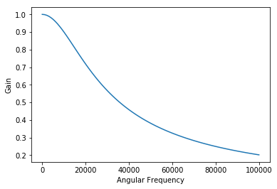

# Frequency response of an RC circuit

The RC circuit can behave in different ways, depending on how we probe it. To achieve a low-pass configuration, we can probe the voltage across the capacitor. In that configuration, high frequencies are bled to ground through the cap. If we decide to swap the components like the figure the right, we have a high-pass filter, where low frequencies are bled to ground instead.

 

Left on its own, the current through the circuit is exactly the same for both scenarios and can be found in another post on LRC analysis:

\begin{align}
I = \frac{V_{in}}{R + \frac{1}{j\omega C}}
\end{align}

We use this expression when examining both the low-pass and high-pass cases even though the wiring appears different. It it is interesting to note that you can wire the two devices in series with the source and whether you measure the voltage over the resistor or the capacitor determines whether it is a high-pass or low-pass circuit, respectively. 


# RC Low-Pass Filter (LPF)

Ultimately we want to come up with the *transfer function* for an RC low-pass circuit. The transfer function $H(\omega)$ is simply the ratio of the output and input voltages as a function of frequency. Determining what that function is requires that we utilize the *impedance* for the RC device.

\begin{align}
H(\omega) = \frac{V_{out}}{V_{in}}
\end{align}

Using the current from above we can write:

\begin{align}
V_{out} = IX_{C} = \frac{V_{in}}{j\omega C(R + \frac{1}{j\omega C})}
\end{align}

Since the transfer function is only the ratio of output to input

\begin{align}
H(\omega) = \frac{1}{1 + j\omega RC}
\end{align}

Notice that the transfer function is complex. We need to find its magnitude which is commonly referred to as the *gain* of the circuit.

\begin{align}
|H(\omega)| = \frac{1}{\sqrt{1 + (\omega RC)^{2}}}
\end{align}

Now, we can plot the gain as a function of frequency.


```python
import numpy as np
import matplotlib.pyplot as plt

def rc_transfer(w, R=0.1, C=0.1): 
    h = 1/np.sqrt(1+(w*R*C)**2)
    return h

w = np.linspace(0, 10e4, 100)
h = rc_transfer(w, R=22e3, C=2.2e-9)

plt.plot(w, h)
plt.ylabel('Gain')
plt.xlabel('Angular Frequency')
plt.show()
```





# RC High-Pass Filter (HPF)

Again, we want to come up with the transfer function this time for a RC high-pass circuit. The only difference is that the output voltage is measured accross the resistor this time:

\begin{align}
V_{out} = \frac{V_{in}R}{R + \frac{1}{j\omega C}}
\end{align}

\begin{align}
H(\omega) = \frac{R}{R + \frac{1}{j\omega C}} = \frac{j\omega RC}{1 + j\omega RC}
\end{align}

As before, we use the complex form of the transfer function to calculate the gain:

\begin{align}
|H(\omega)| = \frac{\omega RC}{\sqrt{1 + (\omega RC)^{2}}}
\end{align}

Now, we can plot the gain as a function of frequency.


```python
import numpy as np
import matplotlib.pyplot as plt

def rc_transfer(w, R=0.1, C=0.1): 
    h = w*R*C/np.sqrt(1+(w*R*C)**2)
    return h

w = np.linspace(0, 10e4, 100)
h = rc_transfer(w, R=22e3, C=2.2e-9)

plt.plot(w, h)
plt.ylabel('Gain')
plt.xlabel('Angular Frequency')
plt.show()
```


```python

```
