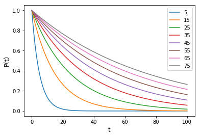

```python
import sys
import numpy as np
import matplotlib
import scipy
from IPython.display import Image
from IPython.core.display import HTML 

print('Python version:\n{}\n'.format(sys.version))
print('Numpy version:\t\t{}'.format(np.__version__))
print('matplotlib version:\t{}'.format(matplotlib.__version__))
print('Scipy version:\t\t{}'.format(scipy.__version__))
```

    Python version:
    3.7.3 (default, Mar 27 2019, 22:11:17) 
    [GCC 7.3.0]
    
    Numpy version:		1.16.2
    matplotlib version:	3.0.3
    Scipy version:		1.2.1


# Quantum nature of light

Perhaps the most interesting of the three noise sources mentioned above is *shot noise* as it is not really noise at all. Rather, shot noise arises because light is made up of particles and the number of those particles arriving at the detector fluctuates according to a statistical distribution. This ultimately stems from the fact that, in quantum mechanics, we cannot explicitly specify the lifetime of the excited state of an electron and therefore cannot predict the arrival time of a fluorescent photon. Instead, we can only specify the probability distribution over all the possible lifetimes or the probability of observing some number of photons at a given time.

# Poisson and Exponential Distributions

Two key probability distributions in photonics are the **Poisson distribution** and the **exponential distribution**. Both of these distrubutions fall under the umbrella of Poisson processes and are just two different ways of the describing the same Poisson process. The Poisson distribution is discrete and provides the probability of observing N events in a fixed time interval. On the other hand, the exponential distribution is continuous and provides the probability of a given time interval between events in a Poisson process. In photonics, the Poisson distribution gives us the probability of observing N photons during the exposure time. The exponential distribution tells us the probability a photon will be emitted as a function of time. Let's look at the Poisson distribution first:

\begin{equation*}
P(n,\mu_{p}) = \frac{\mu_{p}^{n}e^{-\mu_{p}}}{n!}
\end{equation*}

where \\( n \\) is the number of photons observed and \\( \mu_{p} \\) is the expected number of photons to be observed. One important feature of the Poisson distribution is that  \\( \mu_{p}\\) can be written as the product \\( \mu_{p} = \lambda t_{exp} \\) where \\( \lambda \\) is the probability of observing a photon per unit time and \\(t_{exp} \\) is how long you take your measurement. One important feature of the Poisson distribution is that the variance is equal to the mean or \\( \mu_{p} = \sigma_{p}^{2} \\) where \\( \sigma_{p} = \delta n \\) , which is characteristic of all Poisson processes. So, we should expect to see higher variability in the number of detected photons for higher intensities and for longer exposure times. Let's take a look at the form of the Poisson distribution for different values of \\( \lambda \\) keeping \\(t_{exp} \\) fixed at 1.


```python
import matplotlib.pyplot as plt
import numpy as np
import math
from scipy.special import factorial

def poisson(n, mu_p):
    fact = factorial(n)
    p = (mu_p**n)*math.exp(-mu_p)/fact
    return p

n = np.linspace(0,100,100)
for i in range(5, 85, 10):
    p = poisson(n, i)
    plt.plot(n,p, label=str(i))
    
plt.xlabel('n', fontsize=12)
plt.ylabel('P(n)', fontsize=12)
plt.legend()
plt.show()
```





```python
import matplotlib.pyplot as plt
import numpy as np
import math
from scipy.special import factorial

def exponential(t, tau):
    p = np.exp(-t/tau)
    return p

t = np.linspace(0,100,100)
for i in range(5, 85, 10):
    p = exponential(t, i)
    plt.plot(t,p, label=str(i))
    
plt.xlabel('t', fontsize=12)
plt.ylabel('P(t)', fontsize=12)
plt.legend()
plt.show()
```


